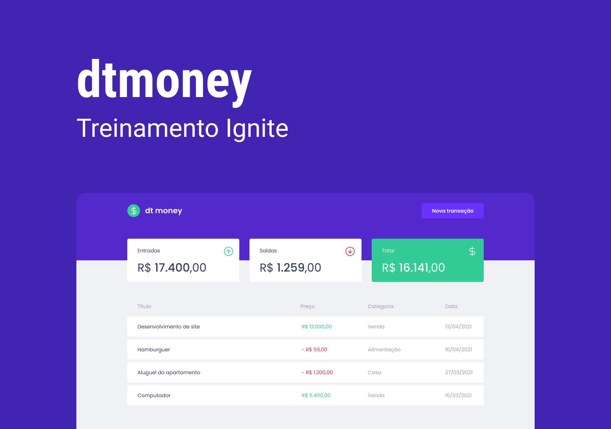

 

 
 

> # About 📚

Dtmoney is a program that calculates monetary transaction inputs and outputs.💰 

> ## Technologies 🔥

 

<ul>

<li><a href='https://pt-br.reactjs.org/'>React</a></li>
<li><a href='https://www.typescriptlang.org/'>TypeScript</a></li>
<li><a href='https://styled-components.com/'>Styled-components</a></li>

</ul>

 

> <h2>Running the project 🚀</h2>

    <ol>
    <li> Clone the repository </l1>
    <li> Install the <a href='https://yarnpkg.com/'><code>yarn</code></a>
    <li> Install dependencies also with <a href='https://yarnpkg.com/'><code>yarn</code></a>
    <li> Start the project with <code>yarn start</code>
    </ol>

 

> ### Final considerations ❤️

First practical project of the third class of Ignite <a href='https://rocketseat.com.br/'>(Rocketseat)</a> with the Diego teacher.

